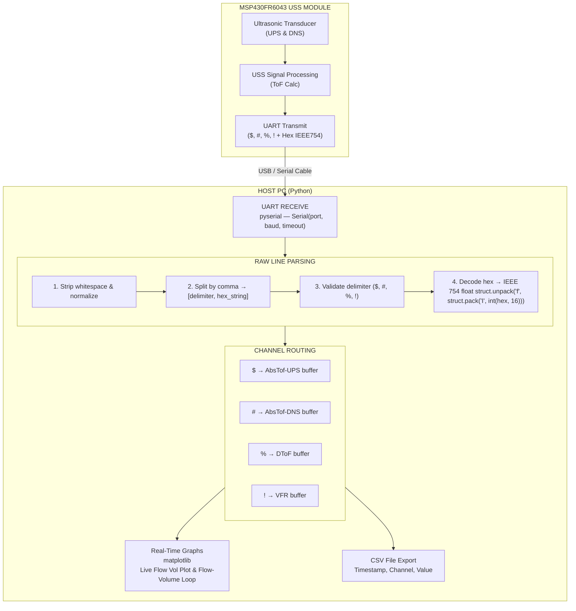
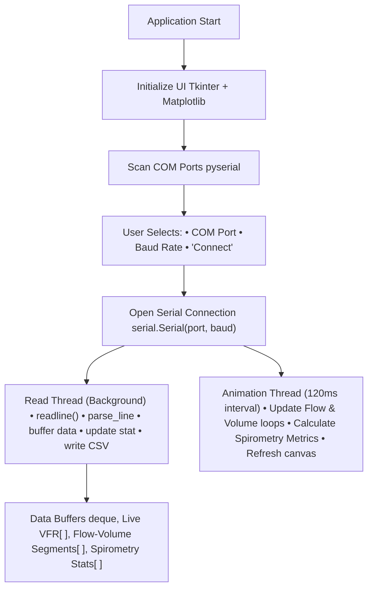

# 📡 UART Communication Module — MSP430FR6043 USS Spirometer

> Serial data acquisition and real-time visualization pipeline for the MSP430FR6043 Ultrasonic Sensing Solution (USS) spirometer — parse raw hex UART frames into meaningful flow measurements.

---

## 📋 Table of Contents

- [Overview](#overview)
- [How It Works](#how-it-works)
- [UART Data Frame Protocol](#uart-data-frame-protocol)
- [Flowchart — Data Acquisition Pipeline](#flowchart--data-acquisition-pipeline)
- [Flowchart — GUI Application](#flowchart--gui-application)
- [File Descriptions](#file-descriptions)
- [Prerequisites](#prerequisites)
- [Installation](#installation)
- [Usage](#usage)
- [Output Channels](#output-channels)
- [Sample Data](#sample-data)
- [GUI Features](#gui-features)
- [Troubleshooting](#troubleshooting)

---

## 📖 Overview

This module provides the **UART-based data output path** for the MSP430FR6043 USS spirometer. Instead of relying on the TI USS Design Center GUI, this approach reads raw serial data directly from the MSP430FR6043 over UART, decodes IEEE 754 hex-encoded floating-point values, and presents them as human-readable spirometry measurements.

**Two tools are provided:**

| Tool            | Purpose                                                                                                                      |
| --------------- | ---------------------------------------------------------------------------------------------------------------------------- |
| `uart_parse.py` | **CLI batch parser** — Converts a raw hex CSV file to decoded output CSV                                                     |
| `uart_gui.py`   | **Real-time Spirometer GUI** — Live monitor with Flow-Volume loops, spirometry metrics (FVC, FEV1, PEF, PIF), and CSV export |

---

## ⚙️ How It Works

The MSP430FR6043 USS module performs ultrasonic time-of-flight (ToF) measurements and transmits the results over **UART** in a compact hex-encoded format. Each UART frame consists of:

1. A **delimiter character** identifying the data channel
2. A **32-bit IEEE 754 hex value** representing the measurement

The Python scripts in this module:

- **Connect** to the MSP430FR6043 via a serial COM port
- **Read** raw UART lines in `<delimiter>,<hex_value>` format
- **Decode** the hex string to an IEEE 754 single-precision float using `struct.unpack`
- **Display/Store** the parsed values for analysis

---

## 📦 UART Data Frame Protocol

Each line transmitted by the MSP430FR6043 follows this format:

```
<DELIMITER>,<HEX_VALUE>\r\n
```

### Delimiter Mapping

| Delimiter | Channel Name   | Description                          | Unit            |
| :-------: | -------------- | ------------------------------------ | --------------- |
|    `$`    | **AbsTof-UPS** | Absolute Time-of-Flight — Upstream   | seconds (s)     |
|    `#`    | **AbsTof-DNS** | Absolute Time-of-Flight — Downstream | seconds (s)     |
|    `%`    | **DToF**       | Delta Time-of-Flight (UPS − DNS)     | seconds (s)     |
|    `!`    | **VFR**        | Volume Flow Rate                     | L/min (approx.) |

### Hex Decoding Example

```
Raw UART line:    $,398B9806
Delimiter:        $  →  AbsTof-UPS
Hex value:        398B9806
```

**Decoding (Python):**

```python
import struct
hex_val = "398B9806"
float_val = struct.unpack("f", struct.pack("I", int(hex_val, 16)))[0]
# Result: 2.662541e-04 seconds (AbsTof-UPS)
```

### Data Sequence

The MSP430FR6043 transmits data in repeating 4-line groups:

```
$,<AbsTof-UPS hex>     ← Upstream ToF
#,<AbsTof-DNS hex>     ← Downstream ToF
%,<DToF hex>           ← Delta ToF
!,<VFR hex>            ← Volume Flow Rate
$,<AbsTof-UPS hex>     ← Next cycle...
...
```

---

## 🔀 Flowchart — Data Acquisition Pipeline



## 🖥️ Flowchart — GUI Application



---

## 📁 File Descriptions

| File                        | Description                                                                                                                                                                            |
| --------------------------- | -------------------------------------------------------------------------------------------------------------------------------------------------------------------------------------- |
| `uart_parse.py`             | **CLI parser** — Reads a raw hex CSV (`hex_in.csv`), decodes each line using the delimiter dictionary and IEEE 754 conversion, and writes decoded output to a new CSV (`hex_out.csv`). |
| `uart_gui.py`               | **GUI application** — Full-featured Tkinter clinical monitor with live spirometry metrics (Exhale/Inhale states), Flow-Volume loops, real-time VFR, and CSV exporter.                  |
| `hex_in.csv`                | **Sample raw input** — Example UART data captured from the MSP430FR6043 (delimiter + hex pairs).                                                                                       |
| `hex_out.csv`               | **Sample decoded output** — Parsed output from `uart_parse.py` showing channel names and decoded float values in scientific notation.                                                  |

---

## 📋 Prerequisites

- **Python 3.7+**
- **MSP430FR6043** (EVM430-FR6043 or custom PCB) connected via USB/Serial

### Python Dependencies

| Package      | Purpose                              |
| ------------ | ------------------------------------ |
| `pyserial`   | Serial port communication            |
| `matplotlib` | Real-time graph plotting             |
| `tkinter`    | GUI framework (included with Python) |

---

## 🔧 Installation

```bash
# Clone the repository
git clone https://github.com/Sasanka-29/MSP430FR6043-USS.git
cd MSP430FR6043-USS/Spirometer/UART

# Install Python dependencies
pip install pyserial matplotlib
```

---

## 🚀 Usage

### Option 1: CLI Batch Parser (`uart_parse.py`)

Parse a previously captured raw hex CSV file:

```bash
python uart_parse.py <input_csv> <output_csv>
```

**Example:**

```bash
python uart_parse.py hex_in.csv hex_out.csv
```

**Input (`hex_in.csv`):**

```csv
$,398B9806
#,398BEBB5
%,B195E300
!,C06FA6C0
```

**Output (`hex_out.csv`):**

```csv
AbsTof-UPS,2.662541e-04
AbsTof-DNS,2.668776e-04
DToF,-4.362278e-09
VFR,-3.744553e+00
```

### Option 2: Real-Time GUI Monitor (`uart_gui.py`)

Launch the live serial monitor:

```bash
python uart_gui.py
```

**Steps:**

1. Select the correct **COM port** from the dropdown
2. Set the **baud rate** (default: `115200`)
3. Click **▶ Connect** to start reading
4. View real-time Volume Flow Rate plot and breath state
5. Review dynamic Flow-Volume loop and calculated spirometry parameters (FVC, FEV1, PEF, PIF)
6. Optionally click **💾 Save CSV** to export data
7. Click **■ Disconnect** when finished

---

## 📊 Output Channels

### 1. AbsTof-UPS (Absolute Time-of-Flight — Upstream)

- **Symbol:** `$`
- **Typical range:** ~2.65e-04 s
- **Description:** Time for the ultrasonic pulse to travel from the upstream transducer to the downstream transducer (with flow direction).

### 2. AbsTof-DNS (Absolute Time-of-Flight — Downstream)

- **Symbol:** `#`
- **Typical range:** ~2.66e-04 s
- **Description:** Time for the ultrasonic pulse to travel from the downstream transducer to the upstream transducer (against flow direction).

### 3. DToF (Delta Time-of-Flight)

- **Symbol:** `%`
- **Typical range:** ±1e-08 s
- **Description:** Difference between upstream and downstream ToF. This value is directly proportional to the flow velocity. Positive = flow in one direction; negative = flow in the opposite direction.

### 4. VFR (Volume Flow Rate)

- **Symbol:** `!`
- **Typical range:** ±50 L/min
- **Description:** Calculated volume flow rate derived from DToF and pipe/tube geometry. This is the primary spirometry measurement used for lung capacity assessment.

---

## 📈 Sample Data

Based on the included `hex_in.csv` → `hex_out.csv`:

| Channel    | Sample Value          | Interpretation                        |
| ---------- | --------------------- | ------------------------------------- |
| AbsTof-UPS | `2.662541e-04` s      | ~266.25 µs upstream transit time      |
| AbsTof-DNS | `2.668776e-04` s      | ~266.88 µs downstream transit time    |
| DToF       | `-4.362278e-09` s     | ~-4.36 ns delta (slight reverse flow) |
| VFR        | `-3.744553e+00` L/min | ~-3.74 L/min flow rate                |

---

## 🎨 GUI Features

| Feature                      | Description                                                                                          |
| ---------------------------- | ---------------------------------------------------------------------------------------------------- |
| 🔌 **Auto Port Detection**   | Scans and lists all available COM ports                                                              |
| 🫁 **Flow-Volume Loop**      | Real-time spirometry flow-volume loop generation                                                     |
| 📈 **Live Flow Graph**       | Real-time Volume Flow Rate (VFR) vs Time rolling plot                                                |
| 📊 **Spirometry Metrics**    | Automatic calculation of **PEF, PIF, FVC, FEV1**, and **FEV1/FVC ratio**                             |
| ⚖️ **Baseline Calibration**  | Zero-flow offset calibration with adjustable deadband                                                |
| 📝 **Breath History Log**    | Scrollable history of localized breath cycle events and individual metrics                           |
| 💾 **CSV Export**            | One-click save to timestamped CSV file                                                               |
| ↺ **Port Refresh**           | Rescan COM ports without restarting                                                                  |
| ✕ **Clear Data**             | Reset all buffers and graphs                                                                         |

### GUI Plot Color Coding

| Entity          | Color                  |
| --------------- | ---------------------- |
| Exhalation      | 🟦 Dark Blue             |
| Inhalation      | 🟥 Dark Red              |
| Live VFR        | 🟨 Amber                |
| Completed Loop  | 🔵 Navy / Shaded         |

---

## 🔧 Troubleshooting

| Issue                     | Solution                                                                                 |
| ------------------------- | ---------------------------------------------------------------------------------------- |
| **No COM ports listed**   | Check USB connection, install drivers (e.g., MSP430 USB CDC drivers), click ↺ Refresh    |
| **Connection error**      | Ensure no other application (CCS, USS GUI) is using the port                             |
| **No data appearing**     | Verify baud rate matches firmware config (default: `115200`), check UART TX pin wiring   |
| **Garbled/unparsed data** | Baud rate mismatch — try different baud rates                                            |
| **"Undefined" in output** | BOM character in first line of CSV — this is normal for the first entry in batch parsing |
| **GUI freezes**           | Large data volume — try reducing the rolling window (`MAX_POINTS` in `uart_gui.py`)      |

---

## 🔗 UART Configuration (Firmware Side)

Ensure the MSP430FR6043 firmware is configured with matching UART settings:

| Parameter        | Value            |
| ---------------- | ---------------- |
| **Baud Rate**    | 115200 (default) |
| **Data Bits**    | 8                |
| **Parity**       | None             |
| **Stop Bits**    | 1                |
| **Flow Control** | None             |
| **Protocol**     | 8N1              |

---

<p align="center">
  <b>Part of the <a href="https://github.com/Sasanka-29/MSP430FR6043-USS">MSP430FR6043-USS Spirometer</a> project</b><br>
  <i>Designed & Developed by <a href="https://github.com/Sasanka-29">Sasanka-29</a></i>
</p>
